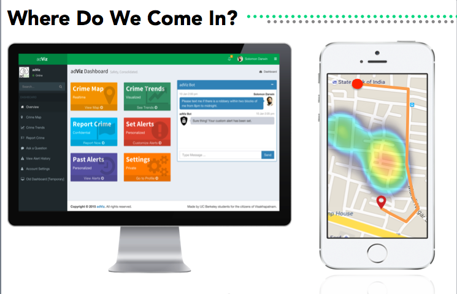
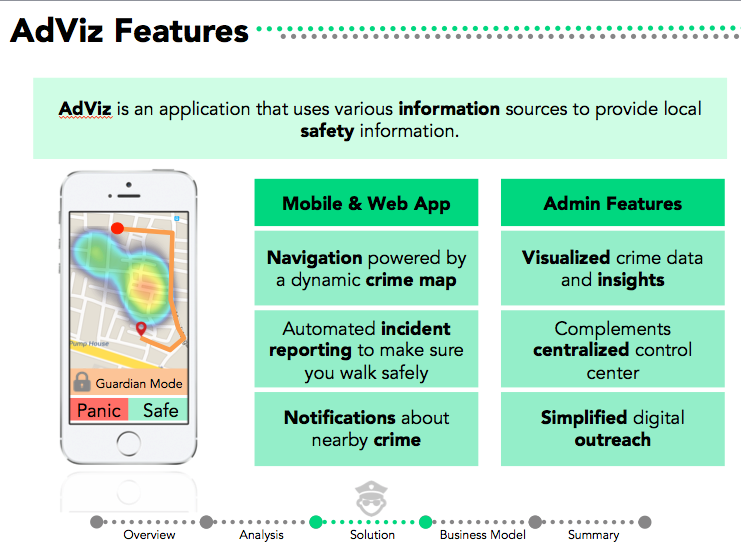
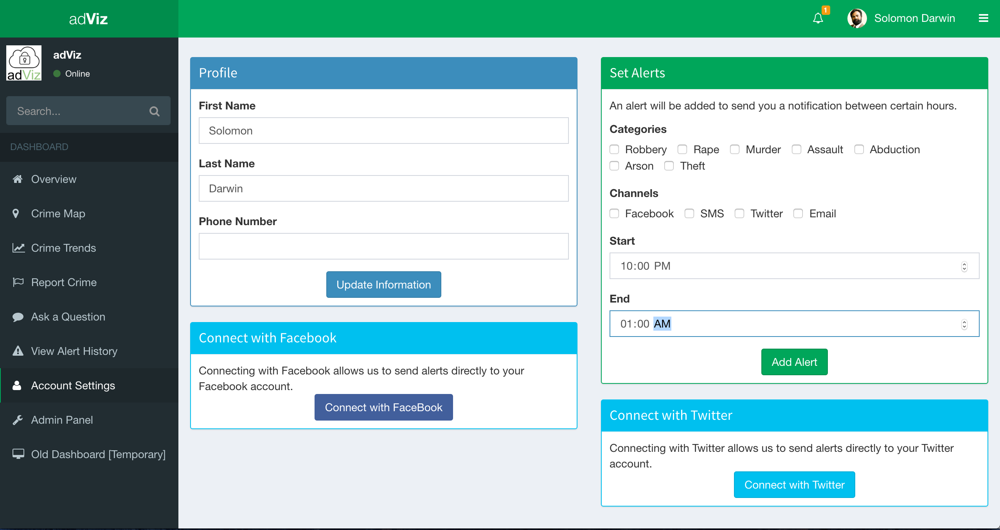
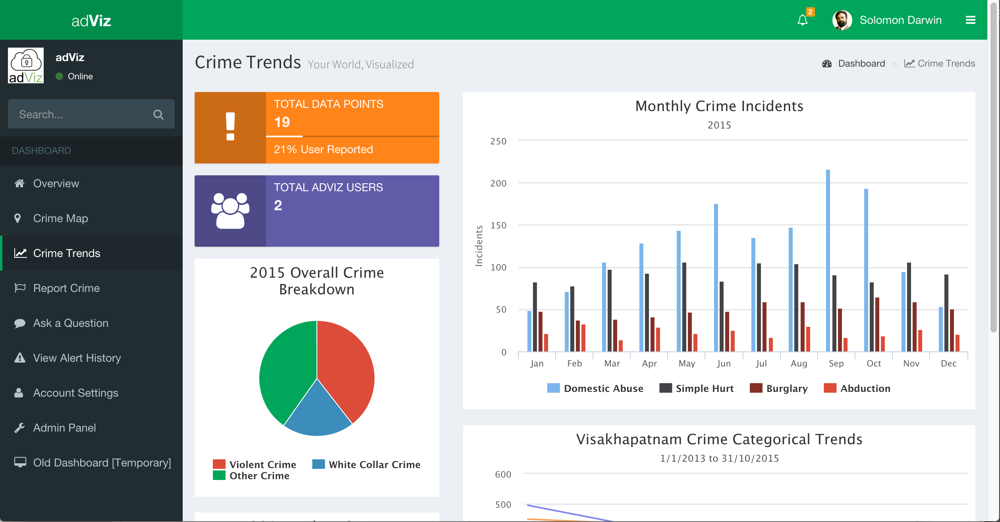
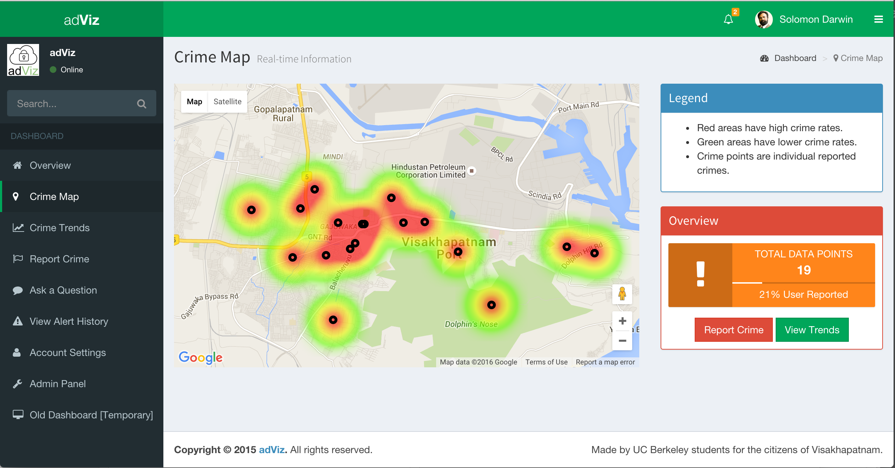

adViz was designed not as just a mobile app or a website, but as a comprehensive solution. The complete vision includes the iOS application, the web application, and the backend that integrates with existing police systems. For the MVP, I created the web application and skeleton UI for the iOS application.

<figure class="half">
	
	
	<figcaption>Components of the full solution. The MVP focussed on the web app.</figcaption>
</figure>

As adViz may be developed further in the future, I won't delve extremely deeply into the codebase. However, I'll be pointing out key APIs, templates, and resources I found useful. 

## The Tech Stack
First and foremost, let's talk tools. To build the MVP, I used to some extent the following:

* [Meteor] for UI, web server, data platform, and deployment
* [Iron Router] for routing
* [MongoDB] for database
* [Bootstrap] for UI
* [AdminLTE] for dashboard UI
* [Autoform] for forms UI
* [Twilio] for SMS
* [Facebook Chat API] for FB Chat
* [Chart.js] for data visualization
* [Google Maps] for maps and navigation
* [IBM Watson] for cognitive computing
* [Heroku] for deployment

I coded with Brackets.io, which I absolute love for front-end and full-stack work. 

## Dashboard UI
I used AdminLTE and customized multiple aspects to 'meteor-ize' it. It was my first time working with Meteor on a significantly large project, so I had to refactor many components and turn them into templates. Unfortunately, I did not find available Meteor Dashboard templates sufficient, which is why I had to go this route and port over a pure HTML/CSS dashboard template. 

## Multi-platform Alerts
For the MVP, I implemented Facebook and SMS alert messages, and sketched out how Twitter alerts would work. 

<figure>
	
</figure>

Facebook messages are actually a bit tricky to implement, as Facebook [removed] the official Chat API service two years ago. The workaround was to use the [unofficial NPM Facebook chat package] and port it over to Meteor. *Update: Meteor 1.3 supports using `npm install` directly, which is awesome!*

SMS messages were easy to hook up with Twilio. My team was able to receive $500 in credit from Twilio, which made developing painless and fun. Thanks Twilio!

## Cognitive Computing
Using [IBM Watson]'s Dialogue, Tradeoff Analytics, and Text-to-Speech, our MVP was able to leverage some of IBM's latest cognitive computing technologies. The dialogue API is used in conversations between civilians and the police, to create a personalized experience to direct civilians to the right parties while saving costs for the police. The messaging endpoints were hooked up to messages hosted on the web application, but can definitely be extended to other platforms in the future. 

## Data Visualization
Using [Chart.js]'s Meteor package, I created an analytics dashboard on data supplied to us by the Vizag Police Department. While the data was by no means comprehensive, I believe that the initial dashboard shows information in a way that is intuitive yet detailed.

<figure>
	
</figure>

Perhaps more importantly, Google Maps enabled us to crime information on a map. For civilians that may care about understanding a graph, a map of their neighborhood is much more accessible. From local crime data to city-wide trends, the crime maps are able to provide information at the scope needed. 

<figure>
	
</figure>

## Safe Navigation
Finally, one of the cornerstones of our pitch: safe navigation. While web-based navigation was not implemented for the MVP, the native IOS application utilized the Google Maps navigation API. As intermediate endpoints are not supported, we calculated many possible routes and stitched them together, balancing transit time and safety.

## My Development Experience
Wow, that's more technologies than I remember working with! Seems like quite a lot when I list them all out. Let's talk about how smoothly the experience went working with all these pieces.

First and foremost, I'd have to say that working with Meteor was great. I've previously worked with Ruby on Rails, and transitioning was surprisingly easy. Many of the packages (I'm looking at you, Admin Dashboards) were a struggle to work with, and I ended up just starting from scratch for many components. 

The easiest APIs to work with were probably Twilio and Google Maps. IBM Watson and the Facebook Chat Package were not too bad, but definitely required a bit more work. 

Front-end wise, I utilized Bootstrap and the AdminLTE template heavily. I started off trying to making everything from scratch, but I quickly realized that there was no way I would be able to build out all the cool features I wanted while making everything look sleek and professional. A few (relatively) short tweaks later, and I was able to personalize the dashboard to look and function pretty great!

Feel free to check out the adViz demo. Some features have been disabled, but most of the MVP is turned on:

<a href="http://getadviz.herokuapp.com" class="btn btn-info">adViz Demo</a>

[Meteor]: <https://www.meteor.com/>
[Iron Router]: <http://iron-meteor.github.io/iron-router/>\ 
[MongoDB]: <https://www.mongodb.com/>
[Bootstrap]: <http://getbootstrap.com/>
[AdminLTE]: <https://almsaeedstudio.com/AdminLTE>
[Autoform]: <https://github.com/aldeed/meteor-autoform>
[Twilio]: <https://www.twilio.com/>
[Facebook Chat API]: <https://github.com/Schmavery/facebook-chat-api>
[Chart.js]: <https://atmospherejs.com/chart/chart>
[Google Maps]: <https://github.com/dburles/meteor-google-maps>
[IBM Watson]: <www.ibm.com/smarterplanet/us/en/ibmwatson/>
[Heroku]: <www.heroku.com>

[removed]: <https://github.com/Schmavery/facebook-chat-api>
[unofficial NPM Facebook chat package]: <https://developers.facebook.com/docs/chat>