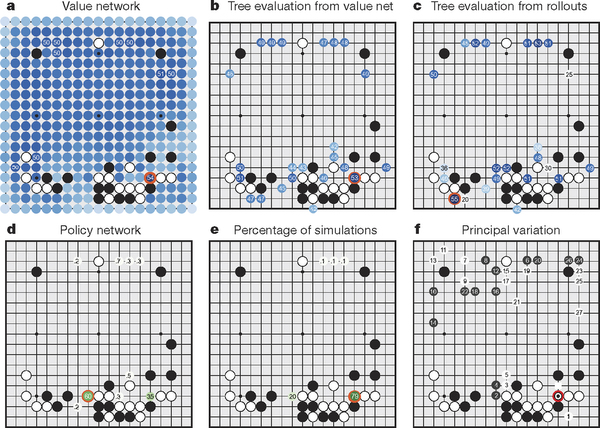
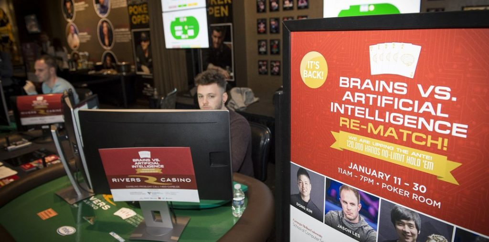

While artificial intelligence agents defeating human competitors in popular games is nothing new, recent benchmarks have evolved at a rate and extent that is truly remarkable. In the past, we’ve seen computers beat the [world chess champion], defeat [Jeopardy! Winners], and master difficult [Atari games]. Recently, however, artificial intelligence agents have done what has often been seen as impossible: beat the world’s best humans at Go and Poker. 

##Early 2016: AlphaGo AI Cracks Go

In March 2016, Google’s AlphaGo artificial intelligence system was able to defeat Lee Sedol, one of the world’s best Go grandmasters, with a resounding [4 wins out of 5 matches]. Go is exponentially more complex than games like chess, and has eluded traditional game-solving approaches that rely on calculating all possible combinations of moves. Google was able to use a Deep Neural Network to perform superbly at this game that supposedly requires, in addition to immaculate calculation skills, a dash of game intuition. 

<figure>
	
</figure>

Funnily enough, some top Go players around the world attributed AlphaGo’s victory to a fluke or luck. Some Go grandmaster’s even took to social media to [challenge AlphaGo]; early this year in January, the AlphaGo team silenced critics by having the artificial intelligence play anonymous online matches against Go masters, and went resoundingly [undefeated].  

##Early 2017: Libratus AI Beats Humans in Poker

Poker is inherently different from other games that have received similar public attention - chess, Go, or even Jeopardy - because poker is a game of incomplete information. Games like chess are fully observed and deterministic in the sense that all players receive the exact same information and know that their actions will result in predictable changes, without worrying about randomness affecting gameplay. Poker, on the other hand, has vast amounts of unequal information (a player cannot the opponent’s cards) and randomness (no one can predict what cards will be dealt in the future). Besides for being incomplete and random, poker is also extremely computationally challenging, just like Go. 

<figure>
	
</figure>

Recently in January, the Libratus Poker AI developed at Carnegie Mellon University defeated four of the world’s best heads-up poker players by a [resounding margin]. Over the course of twenty days, four professional poker players each played 30,000 hands of No-Limit Heads-Up Holdem poker with Libratus, for a total of 120,000 hands. At the end of the matches, Libratus had wracked up a whopping net $1.76 million won over the human competitors. While poker does involve a large amount of chance, this poker challenge [minimized the influence of chance] by mirroring hands across sessions and removing all-in luck. 

Perhaps even more interesting than the decisive victory of Libratus is the fact that this AI did not utilize neural networks. While there is a lot of recent hype around neural networks, Libratus trained through a completely different AI approach known as reinforcement learning, where it learned from trial and error at a massive scale. Instead of learning from the play of human experts, like AlphaGo did, Libratus actually learned by playing [trillions of simulated hands] against itself. Libratus was able to [learn strategies] at a complexity that no human could hope to match - randomizing and mixing bluff ranges, bet sizes, and play styles.  

##Late 2017 and Beyond: What’s Next?

Beyond playing games on a superhuman level, what else might AI be able to do? It’s clear that AI has easily broken through many limits that researches thought would be possible. We are already seeing real-world applications of many of the latest advances in artificial intelligence and machine learning: from autonomous driving to fraud detection to search recommendations. However, the exciting frontiers that AlphaGo and Libratus have broached may not be limited to traditional scenarios.

What AlphaGo and Libratus have shown is that artificial intelligence can excel at managing complexity and reading incomplete information. Traditional AI tasks have often been constrained to very controlled laboratory settings, but these advances bring artificial intelligence one step closer to a wider breadth of realistic applications. Even though we may not ever see robots replace humans as patrons in casinos, we can be confident that we will see AI in a wide variety of scenarios - perhaps even those that seem far-fetched today. 

[world chess champion]: <http://www-03.ibm.com/ibm/history/ibm100/us/en/icons/deepblue/>

[Jeopardy! Winners]: <http://www.techrepublic.com/article/ibm-watson-the-inside-story-of-how-the-jeopardy-winning-supercomputer-was-born-and-what-it-wants-to-do-next/>

[Atari games]: <http://www.wired.co.uk/article/google-deepmind-atari>

[4 wins out of 5 matches]: <https://www.wired.com/2016/03/googles-ai-wins-fifth-final-game-go-genius-lee-sedol/>

[challenge AlphaGo]: <http://www.telegraph.co.uk/news/worldnews/asia/china/12190917/Google-AlphaGo-cant-beat-me-says-China-Go-grandmaster.html>

[undefeated]: <https://thenextweb.com/google/2017/01/05/google-alpha-go-victory/>

[resounding margin]: <https://www.newscientist.com/article/2117920-poker-ai-competes-to-beat-top-players-in-no-limit-game/>

[minimized the influence of chance]: <http://www.pokerlistings.com/libratus-poker-ai-smokes-humans-for-1-76m-is-this-the-end-42839>

[reinforcement learning]: <http://reinforcementlearning.ai-depot.com/>

[trillions of simulated hands]: <https://www.wired.com/2017/02/libratus/>

[learn strategies]: <https://www.technologyreview.com/s/603385/why-poker-is-a-big-deal-for-artificial-intelligence/>

